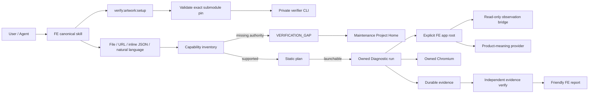

# MakeIt Artwork Verifier

Private, standalone correctness toolkit cho MakeIt Artwork Editor. Repository
này sở hữu skills và tools để static-plan, chạy browser behavior, phân loại
outcome, kiểm tra durable evidence và maintain verification contracts khi
Artwork Editor thay đổi.

- **Package:** `makeit-artwork-verifier@0.1.0`
- **Branch:** `main`
- **License:** `UNLICENSED` — private, không cấp quyền public distribution.
- **Current profile:** representative **Diagnostic correctness** cho frontend
  Artwork Editor.
- **Không claim:** Release Credit, exhaustive coverage, mobile, backend,
  cross-browser hoặc production safety.

## Start here — handoff

Người mới tiếp nhận nên đọc theo thứ tự:

1. [`AGENTS.md`](AGENTS.md) — repository-wide authority, boundaries và rules.
2. [`agents/verify-artwork-editor/SKILL.md`](agents/verify-artwork-editor/SKILL.md)
   — standalone verification workflow.
3. [`agents/verify-artwork-editor/references/cold-agent.md`](agents/verify-artwork-editor/references/cold-agent.md)
   — cold-start commands và evidence interpretation.
4. [`.planning/maintain-verification-skills/PROJECT.md`](.planning/maintain-verification-skills/PROJECT.md)
   — Project Home để thiết kế workflow maintain skills/tools.
5. [`CONTRIBUTING.md`](CONTRIBUTING.md) và [`SECURITY.md`](SECURITY.md).

Nếu mục tiêu chỉ là chạy verification từ một compatible FE host, bắt đầu tại
`agents/verify-artwork-editor/SKILL.md` trong checkout đó và dùng FE wrapper
thay vì gọi standalone CLI trực tiếp.

## Kiến trúc hiện tại

### Repository topology

| Thành phần | Repository | Sở hữu |
|---|---|---|
| Canonical product host target | `MakeIT-POD/fe-editor:dev` | Artwork Editor product, read-only verification bridge, product-meaning provider, consumer adapter, user-facing skill, FE-owned evidence/reports after team-owned merge |
| Secondary transition consumer | [`anhphamwork99/makeit-demo`](https://github.com/anhphamwork99/makeit-demo) | Existing compatible host retained during migration |
| Private verifier | repository này — [`anhphamwork99/makeit-artwork-verifier`](https://github.com/anhphamwork99/makeit-artwork-verifier) | CLI, planner, catalogues, cases, runtime, browser driver, Oracles, evidence contracts/verifier, standalone skill, maintenance Project Home |
| Product/planning records | [`anhphamwork99/makeit-docs`](https://github.com/anhphamwork99/makeit-docs) | Product truth, accepted ADRs và integration acceptance records |
| Official source | `MakeIT-POD/*` | Read-only upstream; không nhận prototype commits hoặc pushes |

FE consume private verifier qua commit-pinned Git submodule:

```text
FE-build/.tooling/makeit-artwork-verifier
```

Data flow một chiều: official source → deliberate prototype adaptation. Prototype
changes không được đẩy ngược về official repositories.

### Runtime flow



### Component responsibilities

#### 1. FE product host

FE là authority cho product behavior và product meaning. Live Diagnostic nhận
explicit `--app-root`; verifier không infer adjacent checkout.

Repository identity không tham gia compatibility. Chạy read-only preflight:

```bash
pnpm cli host doctor --app-root <FE-checkout>
```

Command này chỉ load và validate versioned provider/host contract; nó không
allocate port, start Next.js, launch browser hoặc ghi evidence.

FE cung cấp:

- real Artwork Editor UI;
- read-only `window.__MAKEIT_ARTWORK_VERIFICATION__` bridge;
- `src/lib/artwork/verification/productMeaningProvider.mjs`;
- bridge/provider compatibility descriptor;
- FE-owned evidence, reports và request workspace.

Bridge chỉ quan sát. Fixture và behavior phải được drive qua public UI/native
browser input; bridge không được mutate Artwork state.

#### 2. FE consumer adapter

FE wrapper che giấu submodule/app-root/evidence-root details khỏi người dùng:

```bash
pnpm verify:artwork:setup
pnpm verify:artwork:capabilities
pnpm verify:artwork:run --case <request.json>
pnpm verify:artwork:run --suite representative
pnpm verify:artwork:gap --input <gap.json>
```

Setup chỉ trả `READY` khi exact gitlink, dependencies, Chromium, CLI version và
canonical planning smoke đều pass.

#### 3. Private verifier toolkit

Toolkit sở hữu:

- strict Case Request contracts;
- Subject, Capability, Workflow, Fixture, Correctness, Coverage và Environment
  catalogues;
- static planner và launchability decision;
- pre-allocation FE-host compatibility checks;
- owned process/port/browser lifecycle;
- native-input behavior drivers và Oracles;
- strict run/suite evidence records;
- evidence integrity/readback và exact-id cleanup.

Toolkit không vendor hoặc duplicate product normalization, canonicalization,
fingerprint hay Crossword core.

#### 4. Skills

Canonical standalone skill:

```text
agents/verify-artwork-editor/SKILL.md
```

Cross-harness compatibility projection:

```text
.agents/skills/verify-artwork-editor
  → ../../agents/verify-artwork-editor
```

Không có active `.pi` skill. Legacy `.pi/skills/verify-artwork-editor` value chỉ
được chấp nhận khi đọc historical evidence; nó không phải discovery hoặc
execution authority.

#### 5. Maintenance Project Home

```text
.planning/maintain-verification-skills/PROJECT.md
```

Project hiện ở discovery/wayfinding. Destination là một agent-neutral workflow
có thể biến:

```text
FE source/behavior delta
→ verification impact
→ catalogue/runtime/skill update
→ live proof + failure-boundary proof
→ verifier commit/push
→ FE gitlink/bridge/skill update
→ FE commit/push
```

Không mô tả project này như một implemented maintenance skill trước khi có
engineering specification được owner phê duyệt và implementation gates pass.

## Intake và verification-gap flow

User-facing FE skill nhận:

- representative suite;
- local hoặc toolkit Case Request path;
- URL tài liệu;
- inline JSON;
- natural-language test case.

Agent phải đối chiếu `verify:artwork:capabilities` trước khi author request.
Request mới chỉ có execution authority sau khi static plan trả:

```text
status: PASS
launchAttempted: false
launchability.launchable: true
```

Nếu thiếu Subject, Capability, Scenario, Workflow, Fixture hoặc Oracle
authority, không launch browser. Tạo sanitized `VERIFICATION_GAP` và route tới
maintenance Project Home. Gap không phải `PASS`, `BUG`, `HARNESS_BLOCKED` hay
`ENVIRONMENT_FAILURE`.

## Outcome và scope model

Closed runtime outcomes:

| Outcome | Ý nghĩa |
|---|---|
| `PASS` | Native action và required Oracles pass; cleanup/evidence requirements được đáp ứng |
| `BUG` | Real user action chạy được nhưng product behavior không khớp declared expectation |
| `HARNESS_BLOCKED` | Verifier không thiết lập được trustworthy contract/fixture/target/readiness |
| `ENVIRONMENT_FAILURE` | Launch, browser, process, port, package hoặc host prerequisite thất bại |
| `USAGE` | CLI argument hoặc Case Request không hợp lệ |

Coverage là dimension riêng: `complete`, `partial` hoặc `incomplete`. Một
behavior `PASS` không tự động cấp exhaustive coverage hoặc Release Credit.

## Evidence ownership

Standalone toolkit mặc định ghi generated evidence dưới ignored root:

```text
evidence/
├── runs/<run-id>/
└── suites/<suite-id>/
```

FE adapter bind `MAKEIT_ARTWORK_EVIDENCE_ROOT` tới application-owned workspace:

```text
FE-build/artwork-editor-verification/
├── evidence/
│   ├── runs/
│   └── suites/
├── reports/
└── requests/
```

Mỗi current run chứa tối thiểu:

- `run-record.json` — candidate/source/environment/scope/outcome/cleanup identity;
- `intended-inventory.json` — declared artifact set;
- `final-manifest.json` — sealed transaction và artifact integrity;
- bounded observation/visual artifacts và diagnostics;
- owned server log.

Chỉ kết luận **Đạt** khi behavior status và independent evidence verification
đều `PASS`.

## Prerequisites

| Requirement | Value |
|---|---|
| Node.js | `>=20.11 <25` |
| pnpm | `10.33.0` |
| Install | `pnpm install --frozen-lockfile` |
| Live run | Authorized FE checkout + Playwright Chromium |

## Standalone CLI

```bash
pnpm install --frozen-lockfile
pnpm cli --help
pnpm cli --version
```

Usable commands:

```bash
# Plan only — không launch browser
pnpm cli plan \
  --case cases/diagnostic/requests/layer-text-move-drag-ordinary.json \
  --out ./out/plan

# Static catalogue validation
pnpm cli validate --all

# Live Diagnostic — explicit FE root bắt buộc
pnpm cli diagnostic --case <request.json> --app-root <FE-checkout>
pnpm cli diagnostic --suite representative --app-root <FE-checkout>

# Durable readback và exact-id cleanup
pnpm cli evidence verify --run <run-id>
pnpm cli cleanup --run-id <run-id> --app-root <FE-checkout>
```

`qualify`, `release`, `budget` và `retention` thuộc deferred surface và fail
closed với `NOT_IMPLEMENTED`; chúng không thuộc correctness phase hiện tại.

`validate --all` trong toolkit-only checkout có thể trả `HARNESS_BLOCKED` vì
Crossword product source hoặc accepted suite evidence không được transfer. Đây
là honest refusal, không phải toolkit defect.

## Verification gates

Minimum verifier proof trước commit:

```bash
pnpm test
pnpm test:contract
pnpm test:refusal
pnpm typecheck
pnpm verify:transfer --strict
node bin/verify-artwork.mjs --help
```

Change runtime/browser behavior phải có thêm focused live proof bằng authorized
FE checkout và kiểm tra failure/diagnostic surface liên quan.

## Two-repository change transaction

Khi verifier change ảnh hưởng FE:

1. implement và verify trong private verifier;
2. commit + push verifier `origin/main`;
3. update FE gitlink tới exact pushed verifier commit;
4. verify FE setup, adapter tests, typecheck, build và affected live flow;
5. commit + push FE `origin/main`.

Không để FE pin commit chưa push. Không sửa product chỉ để làm verifier PASS.
Không force-push hoặc rewrite accepted history để recovery.

## Transfer boundary

Tracked planning exception duy nhất:

```text
.planning/maintain-verification-skills/
```

Các nội dung sau không được commit:

- planning/provenance khác dưới `.planning/`;
- generated/historical `evidence/` trong verifier repo;
- dependencies, caches và build output;
- credentials, `.env*`, private keys;
- machine-local artifacts.

`pnpm verify:transfer --strict` kiểm tra ignore rules, tracked inventory,
provenance manifest, compatibility skill symlink và secret signatures.

## Repository layout

```text
AGENTS.md
agents/verify-artwork-editor/                 # canonical standalone skill
.agents/skills/verify-artwork-editor          # compatibility symlink
.planning/maintain-verification-skills/       # maintenance Project Home
bin/verify-artwork.mjs                        # CLI launcher
scripts/verify-transfer.mjs                   # transfer/inventory guard
src/                                          # planner/runtime/evidence/contracts
tests/                                        # toolkit verification
cases/, catalogues/, fixtures/                # versioned verification inputs
governance/authorities/                       # immutable reviewed trust inputs
docs/features/, docs/archive/                 # feature maps và legacy material
provenance/source-manifest.sha256              # extraction baseline
```


## Accepted baseline và references

Agent-neutral migration được ghi tại MakeIt ADR 0127. Baseline handoff ngày
2026-09-28:

- private verifier commit `dd81e3d2d7d970785c051414a74dfd0cd9fa6129`;
- FE integration commit `d293650906dba3be160d73dac6ffc45cc5812668`;
- portable suite `610/610 PASS`;
- contract suite `107/107 PASS`;
- refusal suite `29/29 PASS`;
- FE adapter suite `20/20 PASS`;
- live Text-move behavior + evidence integrity `PASS`.

Repository `main` là current delivery authority; các hash trên là accepted
migration baseline, không phải instruction để downgrade future pins.
